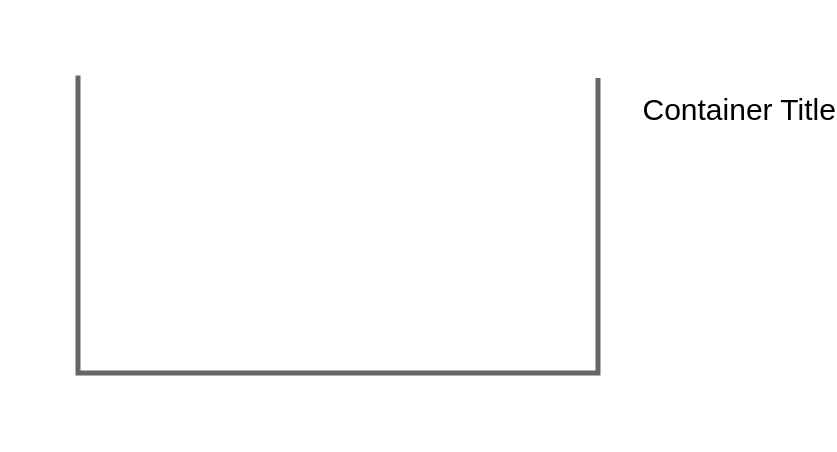

# Shelf

## Definition

```js
{
  _style: {
    container: 'strokeColor=#666666;html=1;labelPosition=right;align=left;spacingLeft=15;shadow=0;dashed=0;outlineConnect=0;shape=mxgraph.rackGeneral.shelf;container=1;collapsible=0',
    entity:{
      strokeColor:'#666666',},
    },
}
```

## Usage

```js
import { Shelf } from '@dinghy/standard-components-diagrams/rackGeneral'

<Shelf/>
```

## Preview


