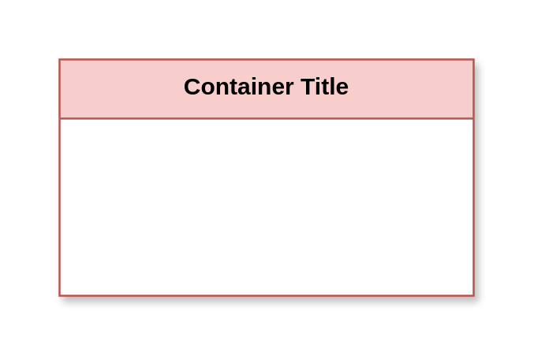

# Threat Actor Table

## Definition

```js
{
  _style: {
    container: 'shape=table;startSize=30;container=1;collapsible=0;childLayout=tableLayout;fillColor=#F8CECC;strokeColor=#B85450;fontStyle=1;shadow=1;swimlaneFillColor=#FFFFFF;fontColor=#000000;whiteSpace=wrap;html=1;',
    entity:{
      strokeColor:'#B85450',fillColor:'#F8CECC',fontColor:'#000000',},
    },
}
```

## Usage

```js
import { ThreatActorTable } from '@dinghy/standard-components-diagrams/threatModeling'

<ThreatActorTable/>
```

## Preview


