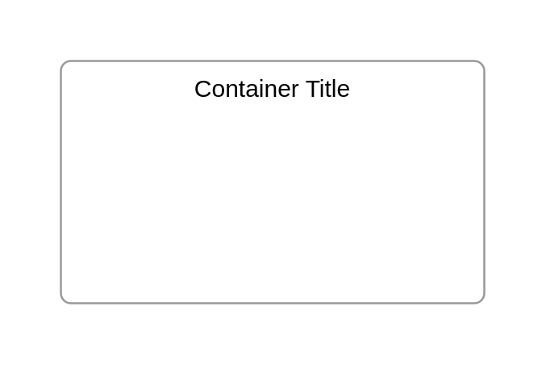

# Dropdown button 6

## Definition

```js
{
  _style: {
    container: 'swimlane;container=1;shape=mxgraph.bootstrap.rrect;rSize=5;strokeColor=#999999;fillColor=#ffffff;fontStyle=0;childLayout=stackLayout;horizontal=1;startSize=0;horizontalStack=0;resizeParent=1;resizeParentMax=0;resizeLast=0;collapsible=0;marginBottom=0;whiteSpace=wrap;html=1;marginTop=10;marginBottom=10;',
    entity:{
      strokeColor:'#999999',fillColor:'#ffffff',},
    },
}
```

## Usage

```js
import { DropdownButton6 } from '@dinghy/standard-components-diagrams/bootstrap'

<DropdownButton6/>
```

## Preview


