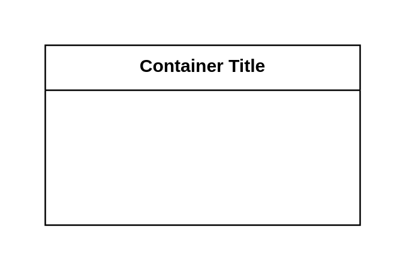

# Table 2

## Definition

```js
{
  _style: {
    container: 'shape=table;startSize=30;container=1;collapsible=1;childLayout=tableLayout;fixedRows=1;rowLines=0;fontStyle=1;align=center;resizeLast=1;html=1;whiteSpace=wrap;',
    },
}
```

## Usage

```js
import { Table2 } from '@dinghy/standard-components-diagrams/entityRelation'

<Table2/>
```

## Preview


