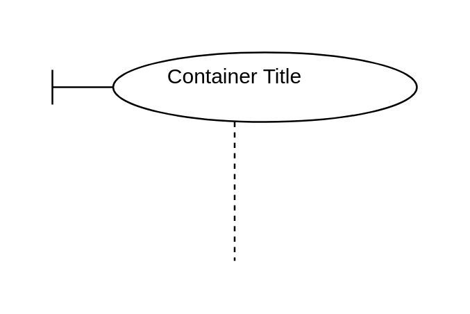

# Boundary Lifeline

## Definition

```js
{
  _style: {
    container: 'shape=umlLifeline;perimeter=lifelinePerimeter;whiteSpace=wrap;html=1;container=1;dropTarget=0;collapsible=0;recursiveResize=0;outlineConnect=0;portConstraint=eastwest;newEdgeStyle={&#34;curved&#34;:0,&#34;rounded&#34;:0};participant=umlBoundary;',
    },
}
```

## Usage

```js
import { BoundaryLifeline } from '@dinghy/standard-components-diagrams/uml'

<BoundaryLifeline/>
```

## Preview


