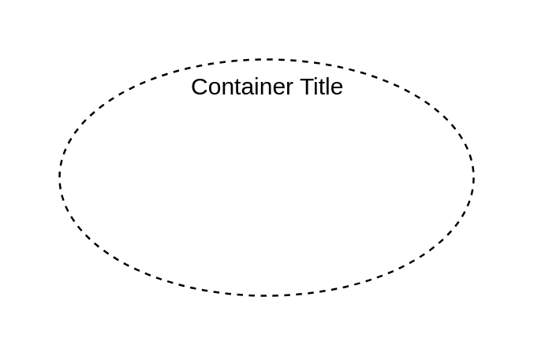

# Classifier 6

## Definition

```js
{
  _style: {
    container: 'shape=ellipse;container=1;horizontal=1;horizontalStack=0;resizeParent=1;resizeParentMax=0;resizeLast=0;html=1;dashed=1;collapsible=0;',
    },
}
```

## Usage

```js
import { Classifier6 } from '@dinghy/standard-components-diagrams/uml25'

<Classifier6/>
```

## Preview


