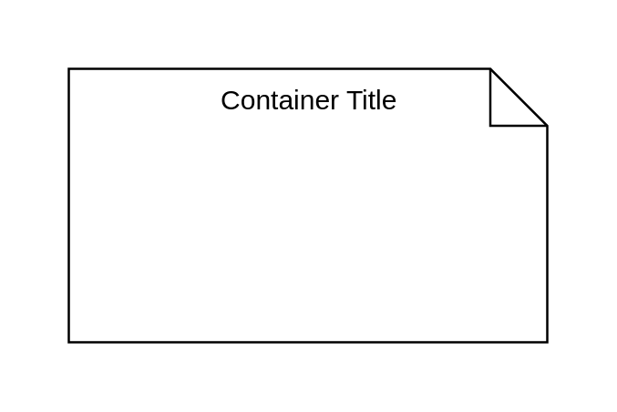

# Stereotype

## Definition

```js
{
  _style: {
    container: 'shape=note2;size=25;childLayout=stackLayout;horizontalStack=0;resizeParent=1;resizeParentMax=0;resizeLast=0;collapsible=0;marginBottom=0;html=1;container=1;',
    },
}
```

## Usage

```js
import { Stereotype } from '@dinghy/standard-components-diagrams/uml25'

<Stereotype/>
```

## Preview


