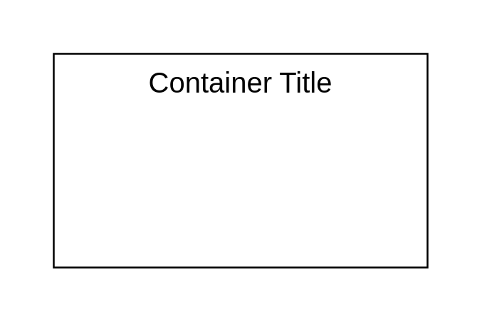

# Table 2

## Definition

```js
{
  _style: {
    container: 'shape=table;html=1;whiteSpace=wrap;startSize=0;container=1;collapsible=0;childLayout=tableLayout;columnLines=0;rowLines=0;fontSize=16;strokeColor=default;',
    },
}
```

## Usage

```js
import { Table2 } from '@dinghy/standard-components-diagrams/misc'

<Table2/>
```

## Preview


