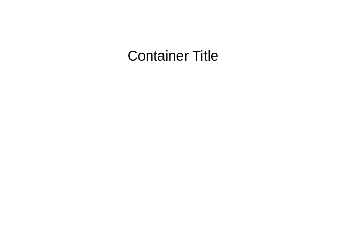

# Vertical List

## Definition

```js
{
  _style: {
    container: 'shape=table;startSize=0;container=1;collapsible=0;childLayout=tableLayout;fontSize=11;fillColor=none;strokeColor=none;',
    },
}
```

## Usage

```js
import { VerticalList } from '@dinghy/standard-components-diagrams/misc'

<VerticalList/>
```

## Preview


