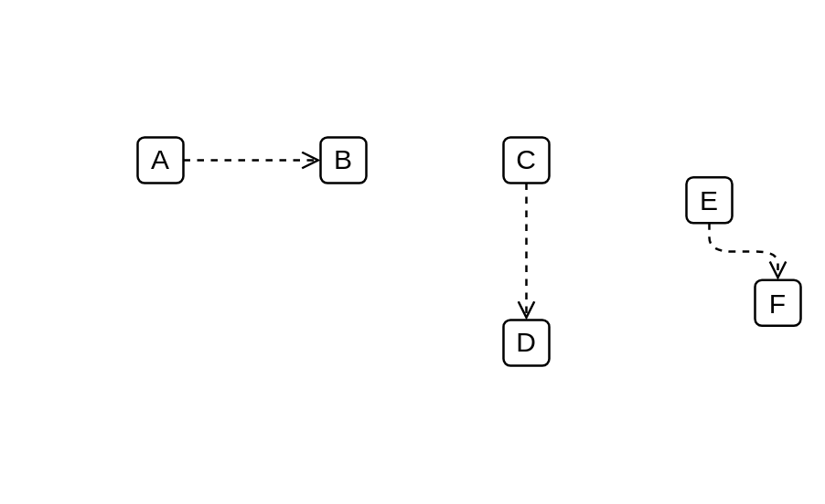

# Access

## Definition

```js
{
  _style: {
    dependency: 'edgeStyle=elbowEdgeStyle;html=1;endArrow=open;elbow=vertical;endFill=1;dashed=1',
  },
}
```

## Usage

```js
import { Access } from '@dinghy/standard-components-diagrams/archimate2'

<Access/>
```

## Preview


