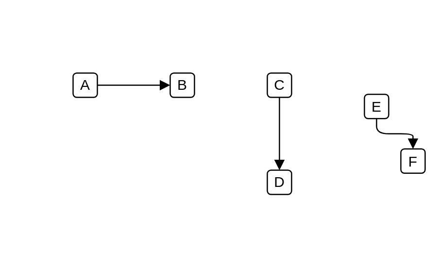

# Triggering

## Definition

```js
{
  _style: {
    dependency: 'endArrow=block;html=1;endFill=1;startArrow=none;startFill=0;edgeStyle=elbowEdgeStyle;elbow=vertical;dashed=0',
  },
}
```

## Usage

```js
import { Triggering } from '@dinghy/standard-components-diagrams/archimate2'

<Triggering/>
```

## Preview


