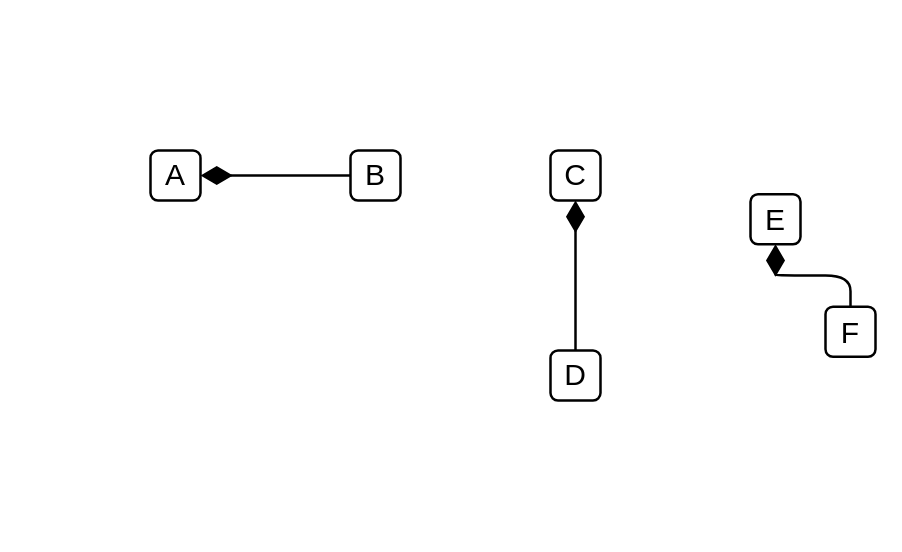

# Composition

## Definition

```js
{
  _style: {
    dependency: 'html=1;startArrow=diamondThin;startFill=1;edgeStyle=elbowEdgeStyle;elbow=vertical;startSize=10;endArrow=none;endFill=0;',
  },
}
```

## Usage

```js
import { Composition } from '@dinghy/standard-components-diagrams/archimate3Relationships'

<Composition/>
```

## Preview


