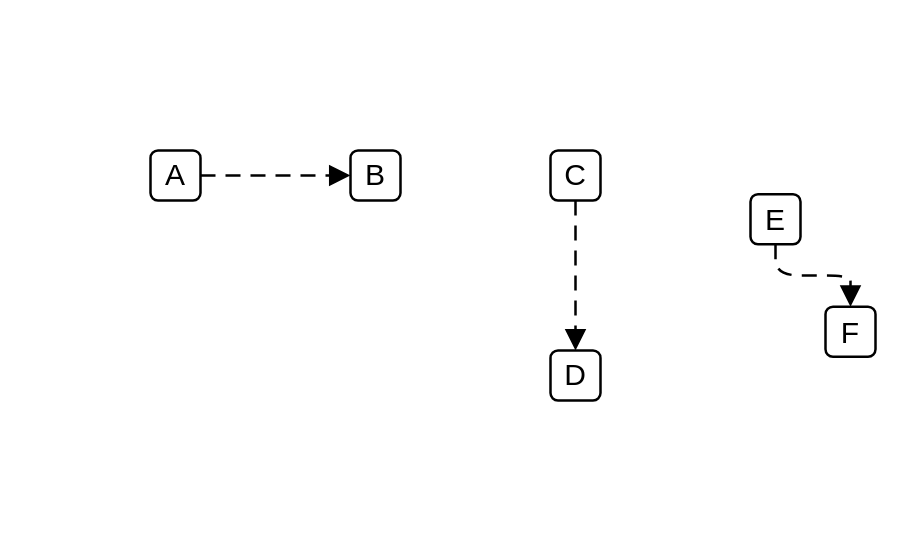

# Flow

## Definition

```js
{
  _style: {
    dependency: 'edgeStyle=elbowEdgeStyle;html=1;endArrow=block;dashed=1;elbow=vertical;endFill=1;dashPattern=6 4;',
  },
}
```

## Usage

```js
import { Flow } from '@dinghy/standard-components-diagrams/archimate3Relationships'

<Flow/>
```

## Preview


