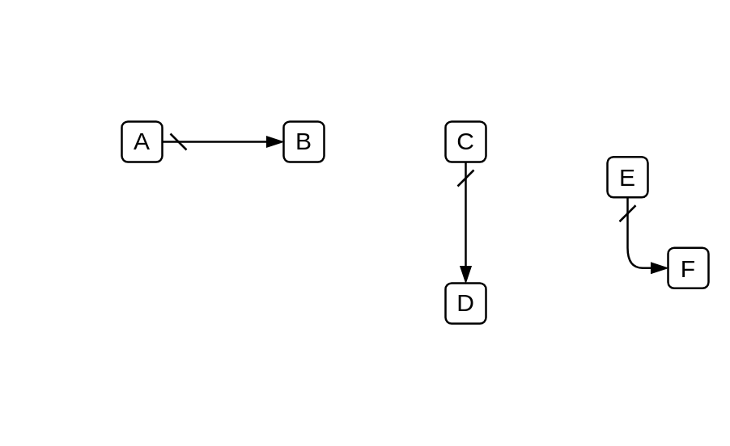

# Default Sequence Flow

## Definition

```js
{
  _style: {
    dependency: 'edgeStyle=elbowEdgeStyle;fontSize=12;html=1;endArrow=blockThin;endFill=1;startArrow=dash;startFill=0;endSize=6;startSize=6;',
  },
}
```

## Usage

```js
import { DefaultSequenceFlow } from '@dinghy/standard-components-diagrams/bpmn2General'

<DefaultSequenceFlow/>
```

## Preview


