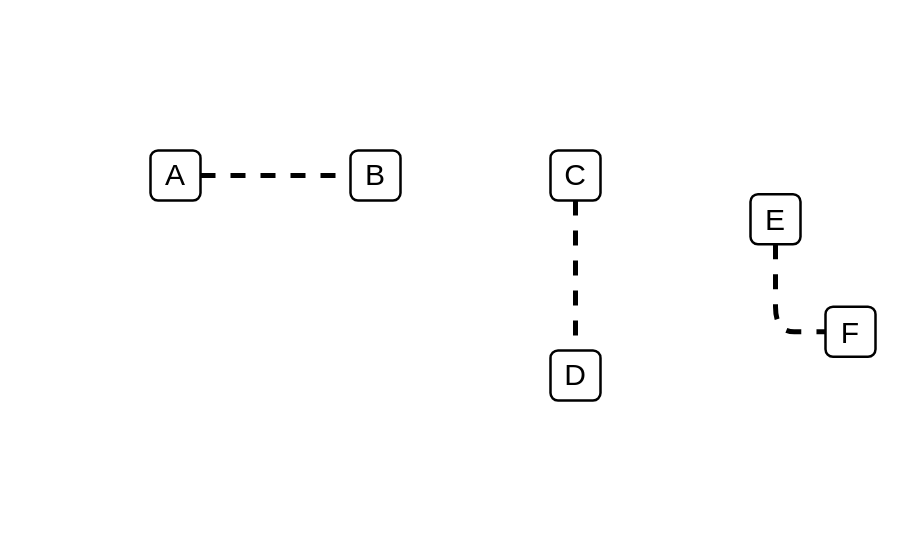

# General Ordering

## Definition

```js
{
  _style: {
    dependency: 'edgeStyle=none;html=1;endArrow=none;verticalAlign=bottom;dashed=1;strokeWidth=2;',
  },
}
```

## Usage

```js
import { GeneralOrdering } from '@dinghy/standard-components-diagrams/sysmlInteractions'

<GeneralOrdering/>
```

## Preview


