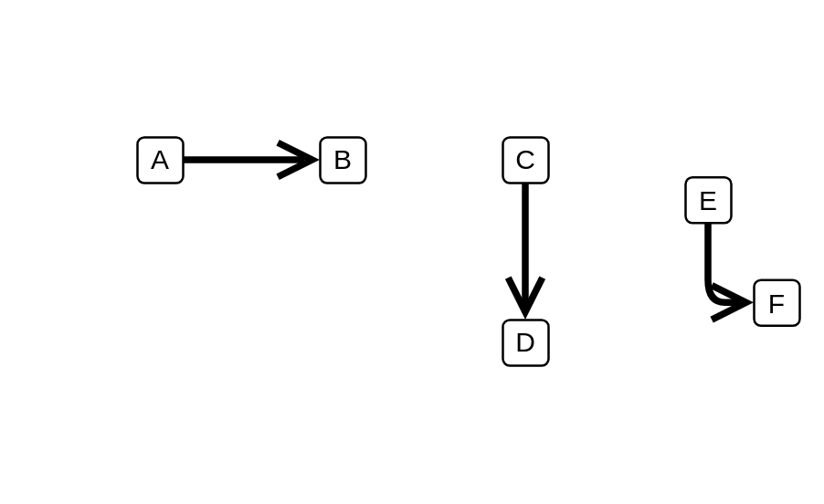

# Transition

## Definition

```js
{
  _style: {
    dependency: 'edgeStyle=none;html=1;endArrow=open;endSize=12;strokeWidth=3;verticalAlign=bottom;',
  },
}
```

## Usage

```js
import { Transition } from '@dinghy/standard-components-diagrams/sysmlStateMachines'

<Transition/>
```

## Preview


