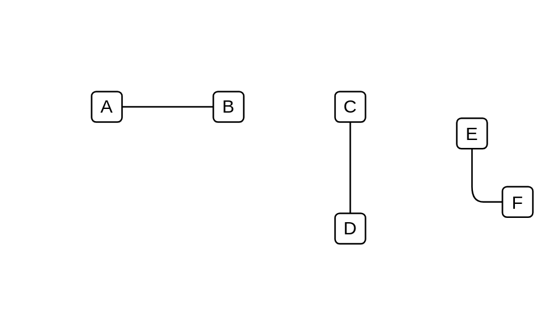

# Communication Path

## Definition

```js
{
  _style: {
    dependency: 'edgeStyle=none;html=1;endArrow=none;verticalAlign=bottom;',
  },
}
```

## Usage

```js
import { CommunicationPath } from '@dinghy/standard-components-diagrams/sysmlUsecases'

<CommunicationPath/>
```

## Preview


