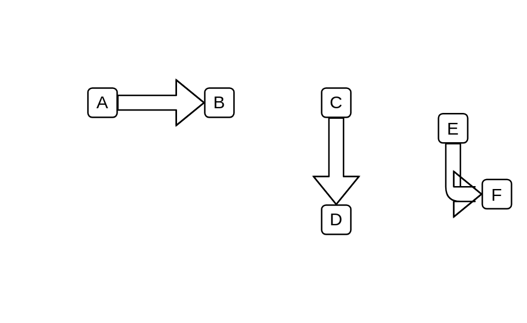

# Shipments

## Definition

```js
{
  _style: {
    dependency: 'shape=flexArrow;html=1;',
  },
}
```

## Usage

```js
import { Shipments } from '@dinghy/standard-components-diagrams/valueStreamMapping'

<Shipments/>
```

## Preview


