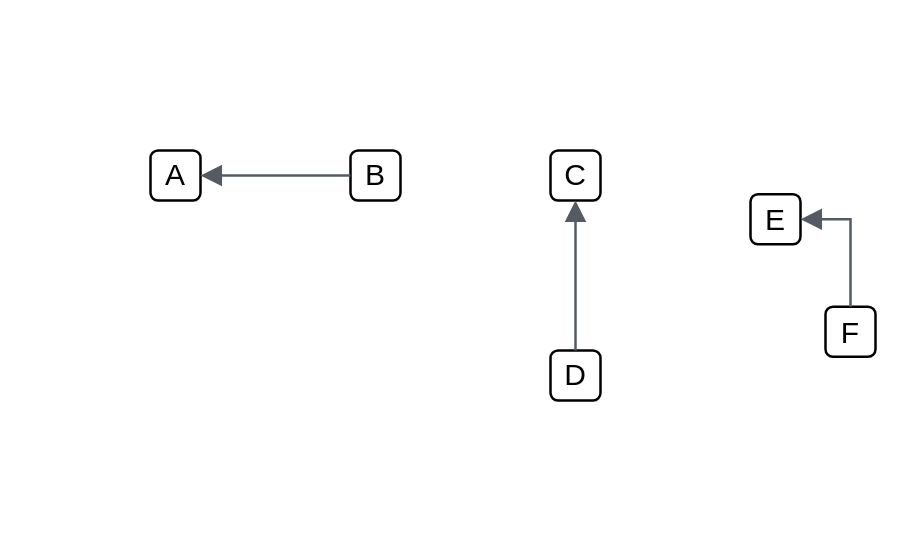
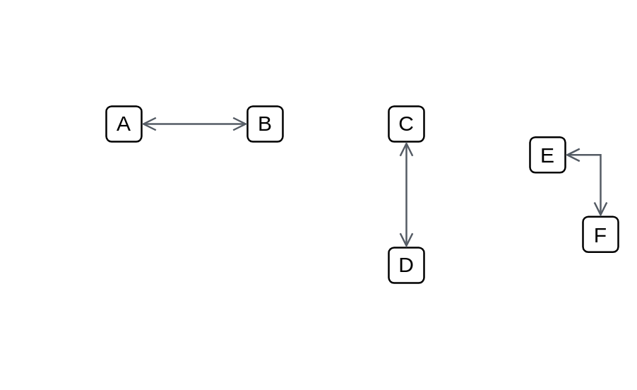
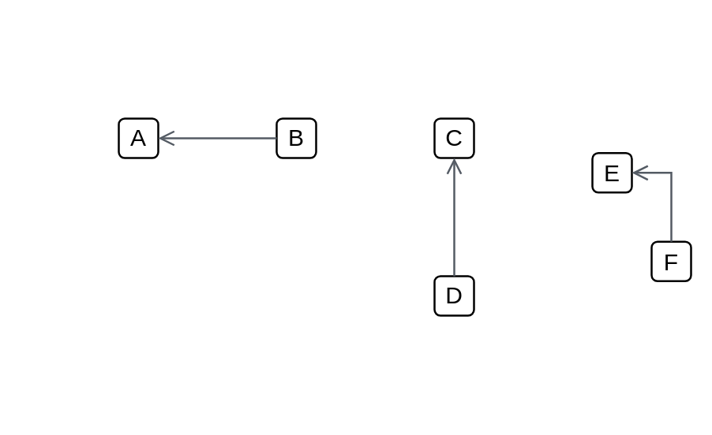

# Aws Arrows Dependencies

- [DefaultDouble](./default-double.md)  

- [DefaultLeft](./default-left.md)  

- [DefaultLeft111](./default-left-111.md)  

- [OpenDouble](./open-double.md)  

- [OpenLeft](./open-left.md)  

- [OpenLeft2](./open-left-2.md)  

- [OpenThinDouble](./open-thin-double.md)  

- [OpenThinLeft](./open-thin-left.md)  

- [OpenThinLeft2](./open-thin-left-2.md)  

