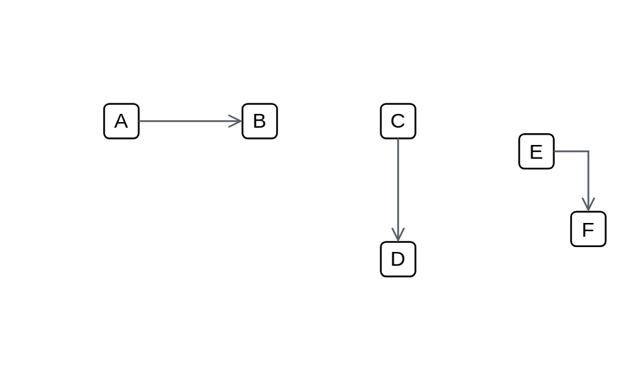

# Open (left) 2

## Definition

```js
{
  _style: {
    dependency: 'edgeStyle=orthogonalEdgeStyle;html=1;endArrow=open;elbow=vertical;startArrow=none;endFill=0;strokeColor=#545B64;rounded=0;',
  },
}
```

## Usage

```js
import { OpenLeft2 } from '@dinghy/standard-components-diagrams/awsArrows'

<OpenLeft2/>
```

## Preview


