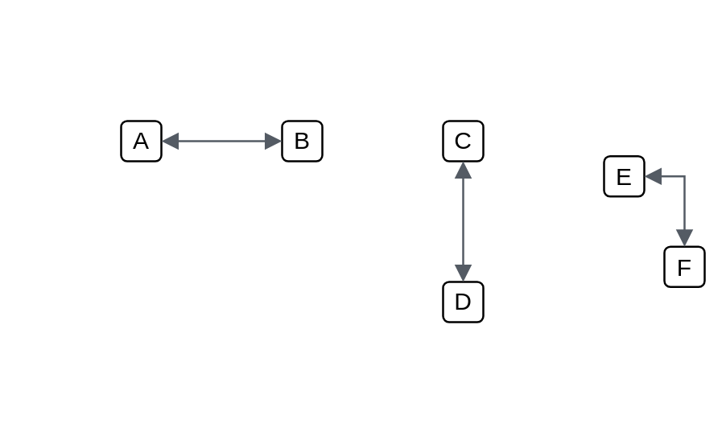

# Default (double)

## Definition

```js
{
  _style: {
    dependency: 'edgeStyle=orthogonalEdgeStyle;html=1;endArrow=block;elbow=vertical;startArrow=block;startFill=1;endFill=1;strokeColor=#545B64;rounded=0;',
  },
}
```

## Usage

```js
import { DefaultDouble } from '@dinghy/standard-components-diagrams/aws18Arrows'

<DefaultDouble/>
```

## Preview


