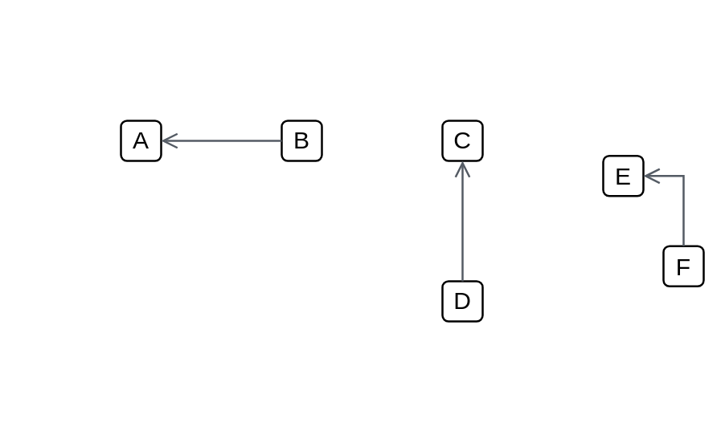

# Open (left)

## Definition

```js
{
  _style: {
    dependency: 'edgeStyle=orthogonalEdgeStyle;html=1;endArrow=none;elbow=vertical;startArrow=open;startFill=0;strokeColor=#545B64;rounded=0;',
  },
}
```

## Usage

```js
import { OpenLeft } from '@dinghy/standard-components-diagrams/aws18Arrows'

<OpenLeft/>
```

## Preview


