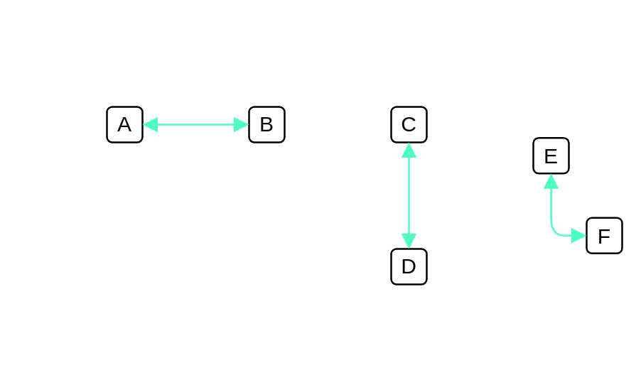

# OOB / RMP

## Definition

```js
{
  _style: {
    dependency: 'endArrow=block;html=1;startArrow=block;startFill=1;endFill=1;strokeColor=#4EFDC0;',
  },
}
```

## Usage

```js
import { OobRmp } from '@dinghy/standard-components-diagrams/cumulus'

<OobRmp/>
```

## Preview


