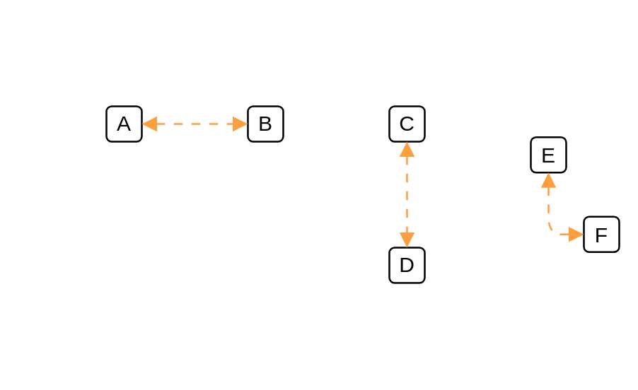

# Virtual 2

## Definition

```js
{
  _style: {
    dependency: 'endArrow=block;html=1;startArrow=block;startFill=1;endFill=1;strokeColor=#FB9F41;dashed=1;dashPattern=5 5;',
  },
}
```

## Usage

```js
import { Virtual2 } from '@dinghy/standard-components-diagrams/cumulus'

<Virtual2/>
```

## Preview


