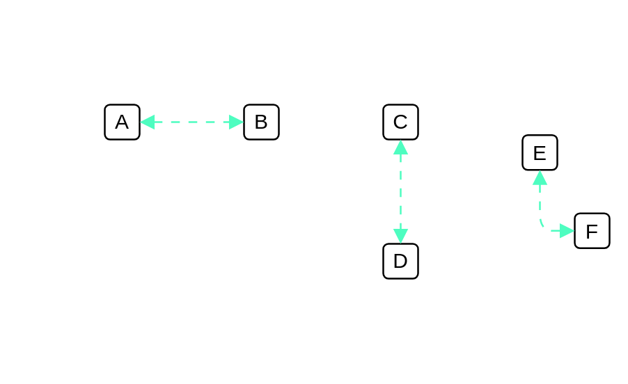

# Virtual 6

## Definition

```js
{
  _style: {
    dependency: 'endArrow=block;html=1;startArrow=block;startFill=1;endFill=1;strokeColor=#4EFDC0;dashed=1;dashPattern=5 5;',
  },
}
```

## Usage

```js
import { Virtual6 } from '@dinghy/standard-components-diagrams/cumulus'

<Virtual6/>
```

## Preview


