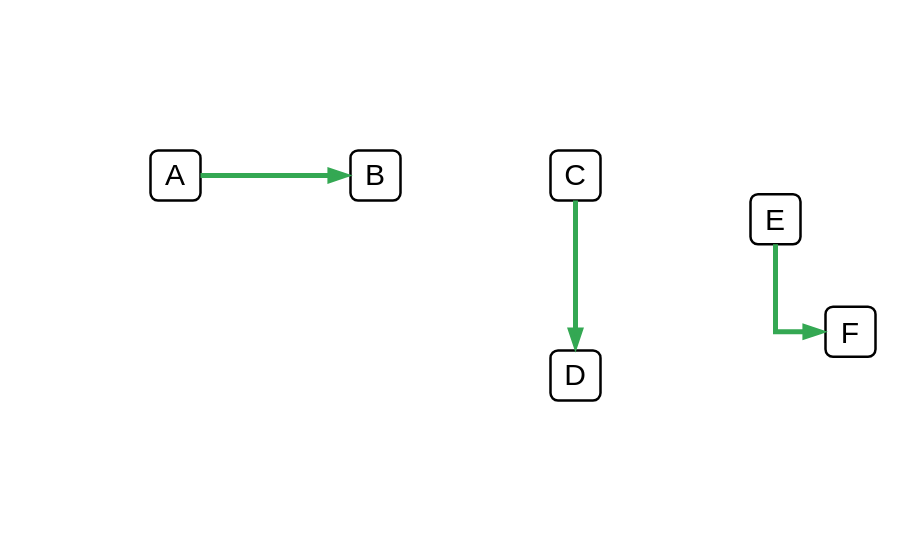

# Success Status

## Definition

```js
{
  _style: {
    dependency: 'edgeStyle=orthogonalEdgeStyle;fontSize=12;html=1;endArrow=blockThin;endFill=1;rounded=0;strokeWidth=2;endSize=4;startSize=4;strokeColor=#34A853;dashed=0;',
  },
}
```

## Usage

```js
import { SuccessStatus } from '@dinghy/standard-components-diagrams/gcp2Paths'

<SuccessStatus/>
```

## Preview


