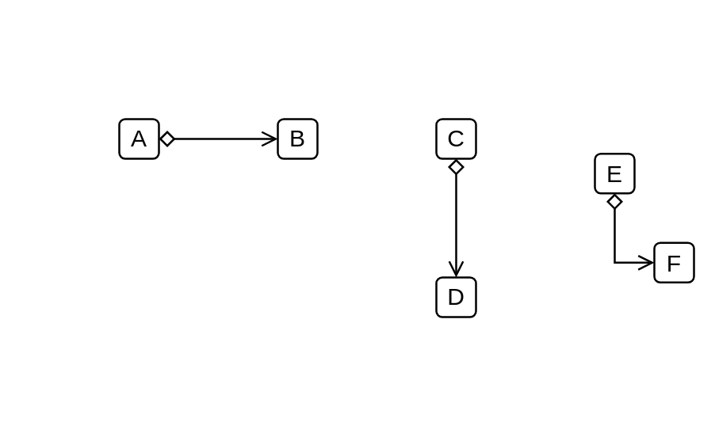

# Aggregation

## Definition

```js
{
  _style: {
    dependency: 'html=1;labelBackgroundColor=#ffffff;jettySize=auto;orthogonalLoop=1;fontSize=14;rounded=0;jumpStyle=gap;edgeStyle=orthogonalEdgeStyle;startArrow=diamond;startFill=0;endArrow=open;strokeWidth=1;',
  },
}
```

## Usage

```js
import { Aggregation } from '@dinghy/standard-components-diagrams/ibmCloudConnectors'

<Aggregation/>
```

## Preview


