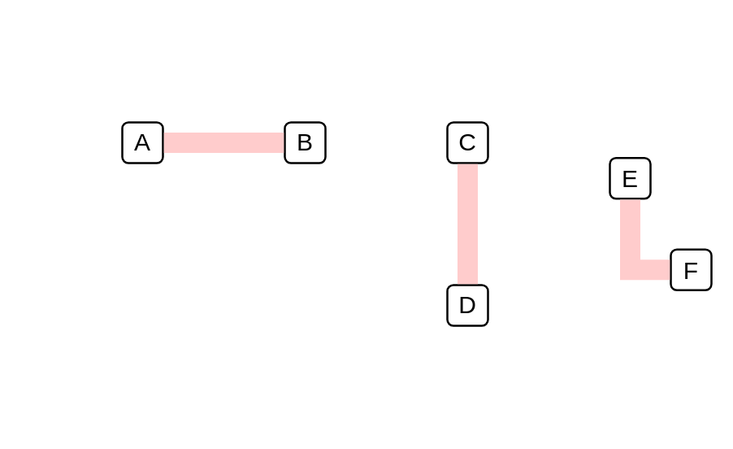

# Tunnel Connector

## Definition

```js
{
  _style: {
    dependency: 'html=1;labelBackgroundColor=#ffffff;jettySize=auto;orthogonalLoop=1;fontSize=14;rounded=0;jumpStyle=gap;edgeStyle=orthogonalEdgeStyle;shape=flexArrow;startArrow=none;endArrow=none;fillColor=#FFCCCC;strokeColor=none;',
  },
}
```

## Usage

```js
import { TunnelConnector } from '@dinghy/standard-components-diagrams/ibmCloudConnectors'

<TunnelConnector/>
```

## Preview


