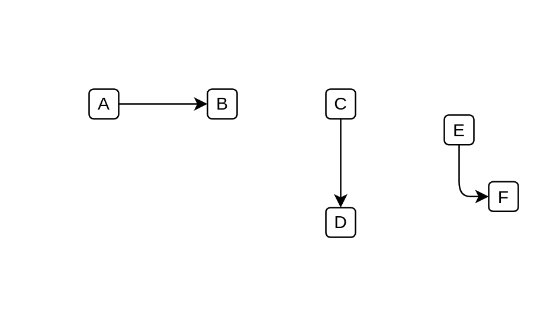
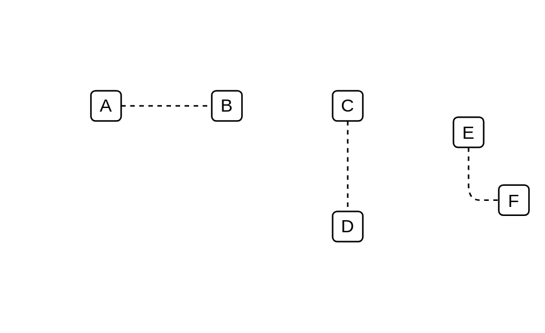
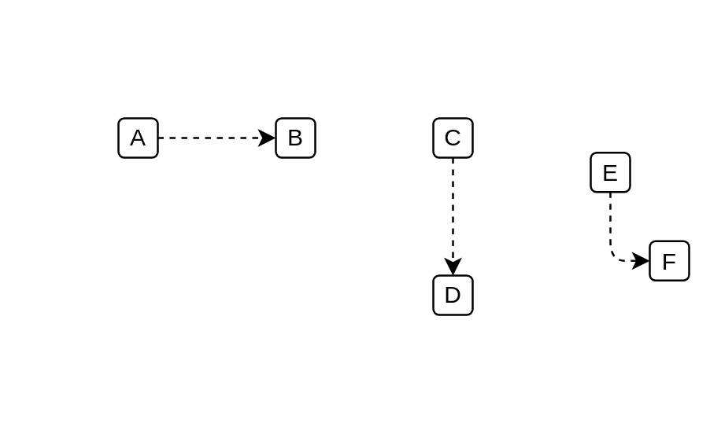
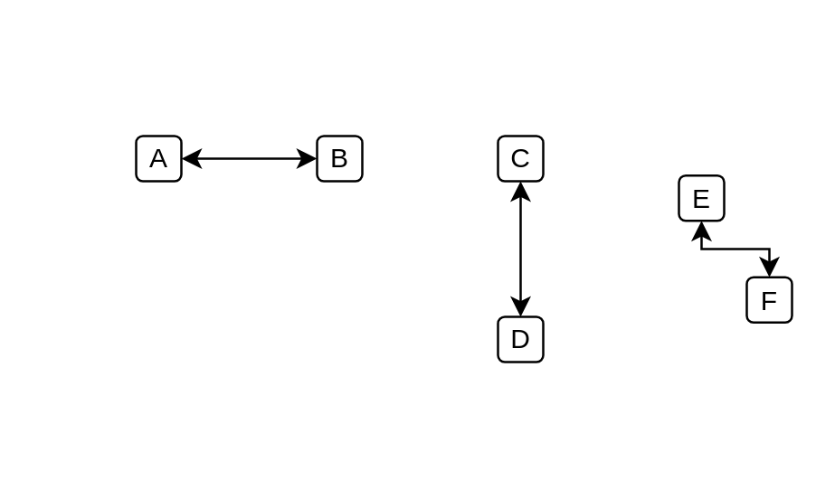

# Ibm Connectors Dependencies

- [Connector](./connector.md)  

- [ConnectorDoubleArrow](./connector-double-arrow.md)  

- [ConnectorSingleArrow](./connector-single-arrow.md)  

- [DashedConnector](./dashed-connector.md)  

- [DashedConnectorDoubleArrow](./dashed-connector-double-arrow.md)  

- [DashedConnectorSingleArrow](./dashed-connector-single-arrow.md)  

- [ElbowConnector](./elbow-connector.md)  

- [ElbowConnectorDoubleArrow](./elbow-connector-double-arrow.md)  

- [ElbowConnectorSingleArrow](./elbow-connector-single-arrow.md)  

