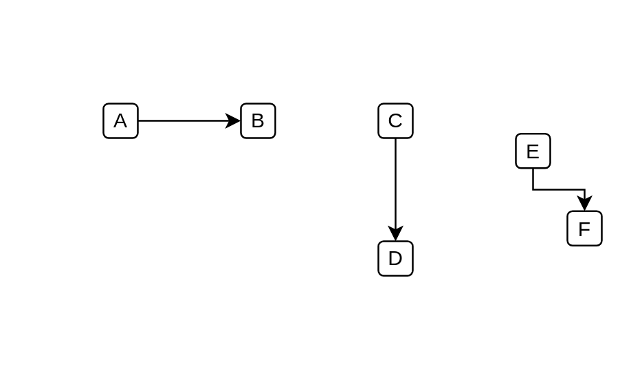

# Elbow Connector (Single Arrow)

## Definition

```js
{
  _style: {
    dependency: 'edgeStyle=elbowEdgeStyle;rounded=0;elbow=vertical;html=1;labelBackgroundColor=#ffffff;endArrow=classic;endFill=1;endSize=6;jettySize=auto;orthogonalLoop=1;strokeWidth=1;fontSize=14;',
  },
}
```

## Usage

```js
import { ElbowConnectorSingleArrow } from '@dinghy/standard-components-diagrams/ibmConnectors'

<ElbowConnectorSingleArrow/>
```

## Preview


