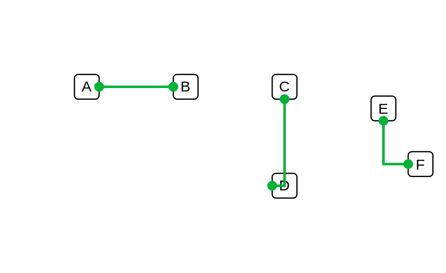

# Connector #2 (topaz)

## Definition

```js
{
  _style: {
    dependency: 'edgeStyle=none;rounded=0;html=1;entryX=0;entryY=0.5;jettySize=auto;orthogonalLoop=1;strokeColor=#00B336;strokeWidth=2;fontColor=#000000;jumpStyle=none;endArrow=oval;endFill=1;startArrow=oval;startFill=1;',
  },
}
```

## Usage

```js
import { Connector2Topaz } from '@dinghy/standard-components-diagrams/veeam2Auxiliary'

<Connector2Topaz/>
```

## Preview


