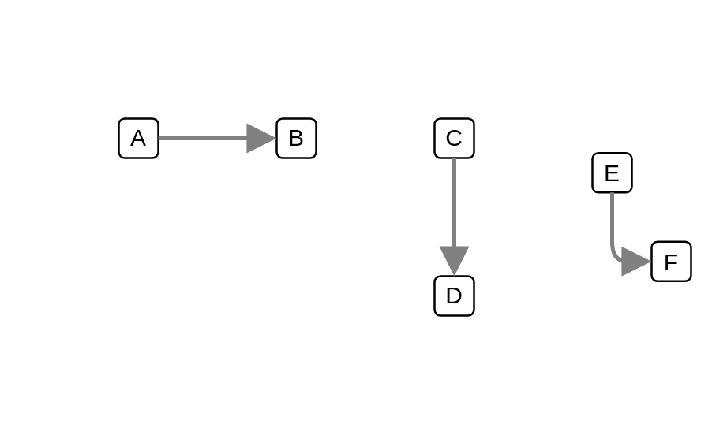

# Pipe

## Definition

```js
{
  _style: {
    dependency: 'edgeStyle=none;html=1;strokeColor=#808080;endArrow=block;endSize=10;dashed=0;verticalAlign=bottom;strokeWidth=2;',
  },
}
```

## Usage

```js
import { Pipe } from '@dinghy/standard-components-diagrams/eipMessageConstruction'

<Pipe/>
```

## Preview


