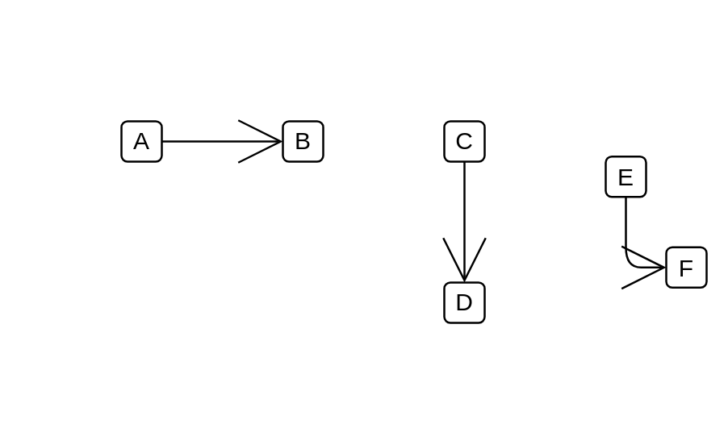

# M/F Contact

## Definition

```js
{
  _style: {
    dependency: 'endArrow=open;html=1;strokeWidth=1;endFill=0;endSize=20;',
  },
}
```

## Usage

```js
import { MFContact } from '@dinghy/standard-components-diagrams/electricalMisc'

<MFContact/>
```

## Preview


