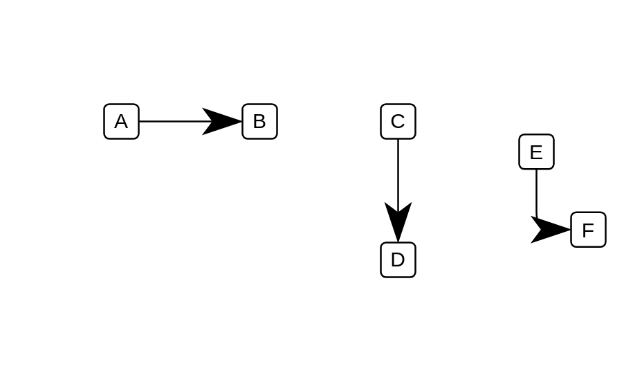

# Direction of Flow

## Definition

```js
{
  _style: {
    dependency: 'endArrow=classicThin;html=1;strokeWidth=1;endSize=20;',
  },
}
```

## Usage

```js
import { DirectionOfFlow } from '@dinghy/standard-components-diagrams/electricalTransmissionPaths'

<DirectionOfFlow/>
```

## Preview


