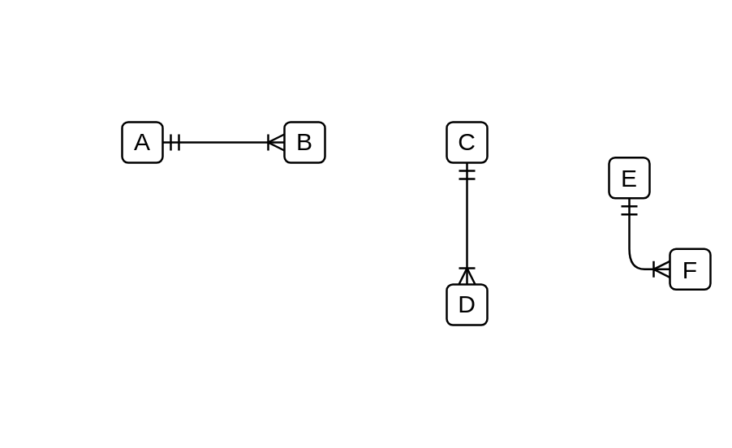

# Software Entity Relation Dependencies

- [Component0To1](./component-0-to-1.md)  

- [Component0ToManyOptional](./component-0-to-many-optional.md)  

- [Component1](./component-1.md)  

- [Component1Mandatory](./component-1-mandatory.md)  

- [Component1MandatoryTo1Optional](./component-1-mandatory-to-1-optional.md)  

- [Component1MandatoryToManyMandatory](./component-1-mandatory-to-many-mandatory.md)  

- [Component1MandatoryToManyOptional](./component-1-mandatory-to-many-optional.md)  

- [Component1OptionalToManyMandatory](./component-1-optional-to-many-mandatory.md)  

- [Component1OptionalToManyOptional](./component-1-optional-to-many-optional.md)  

- [Component1To1](./component-1-to-1.md)  

- [Component1ToMany](./component-1-to-many.md)  

- [Many](./many.md)  

- [ManyMandatoryToManyMandatory](./many-mandatory-to-many-mandatory.md)  

- [ManyOptionalToManyMandatory](./many-optional-to-many-mandatory.md)  

- [ManyOptionalToManyOptional](./many-optional-to-many-optional.md)  

- [ManyToMany](./many-to-many.md)  

