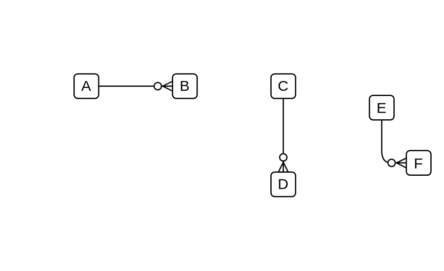

# 0 to Many Optional

## Definition

```js
{
  _style: {
    dependency: 'edgeStyle=entityRelationEdgeStyle;fontSize=12;html=1;endArrow=ERzeroToMany;endFill=1;',
  },
}
```

## Usage

```js
import { Component0ToManyOptional } from '@dinghy/standard-components-diagrams/entityRelation'

<Component0ToManyOptional/>
```

## Preview


