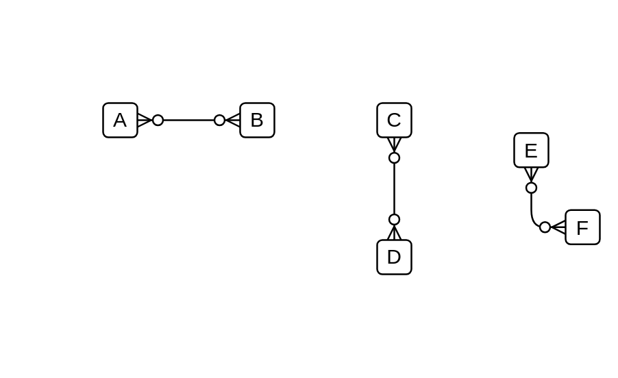

# Many Optional to Many Optional

## Definition

```js
{
  _style: {
    dependency: 'edgeStyle=entityRelationEdgeStyle;fontSize=12;html=1;endArrow=ERzeroToMany;endFill=1;startArrow=ERzeroToMany;',
  },
}
```

## Usage

```js
import { ManyOptionalToManyOptional } from '@dinghy/standard-components-diagrams/entityRelation'

<ManyOptionalToManyOptional/>
```

## Preview


