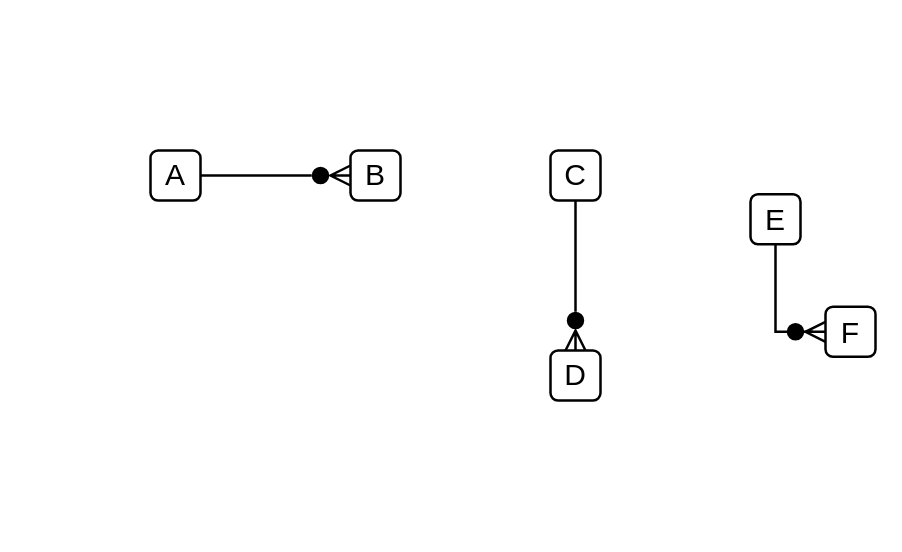

# Default Relationship Connector

## Definition

```js
{
  _style: {
    dependency: 'edgeStyle=entityRelationEdgeStyle;fontSize=12;html=1;endArrow=manyOptional;endFill=1;startArrow=none;rounded=0;startFill=0;',
  },
}
```

## Usage

```js
import { DefaultRelationshipConnector } from '@dinghy/standard-components-diagrams/salesforceComponents'

<DefaultRelationshipConnector/>
```

## Preview


