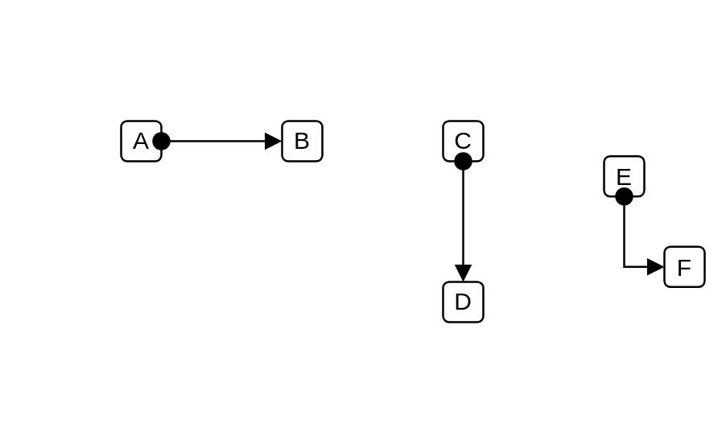

# Found Message 1

## Definition

```js
{
  _style: {
    dependency: 'html=1;verticalAlign=bottom;startArrow=oval;startFill=1;endArrow=block;startSize=8;curved=0;rounded=0;',
  },
}
```

## Usage

```js
import { FoundMessage1 } from '@dinghy/standard-components-diagrams/uml'

<FoundMessage1/>
```

## Preview


