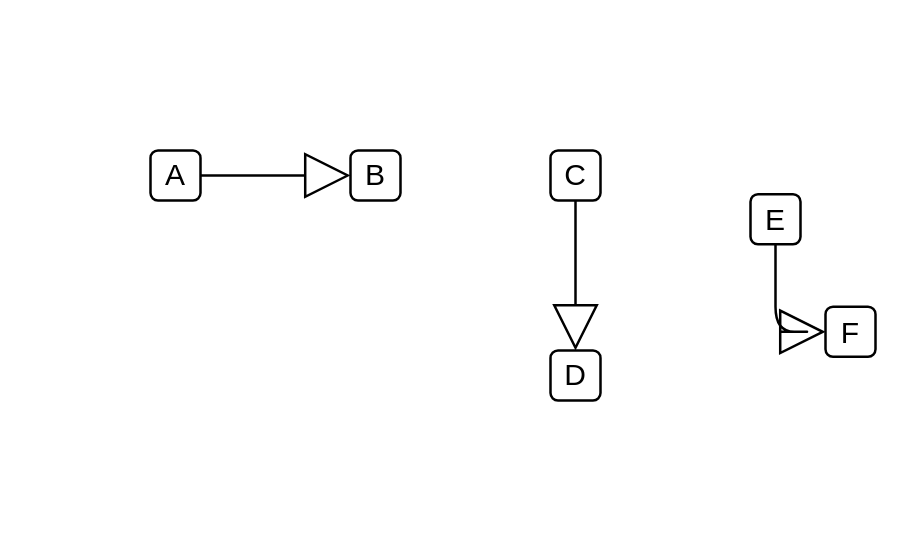

# Generalization

## Definition

```js
{
  _style: {
    dependency: 'endArrow=block;endSize=16;endFill=0;html=1;',
  },
}
```

## Usage

```js
import { Generalization } from '@dinghy/standard-components-diagrams/uml'

<Generalization/>
```

## Preview


