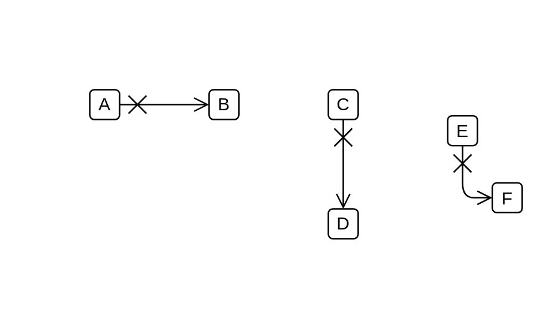

# Terminate

## Definition

```js
{
  _style: {
    dependency: 'endArrow=open;startArrow=cross;endFill=0;startFill=0;endSize=8;startSize=10;html=1;',
  },
}
```

## Usage

```js
import { Terminate } from '@dinghy/standard-components-diagrams/uml'

<Terminate/>
```

## Preview


