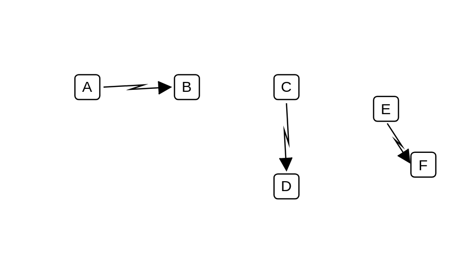
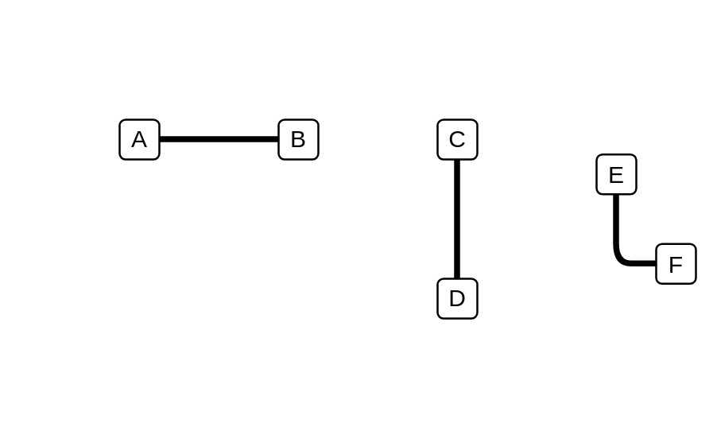
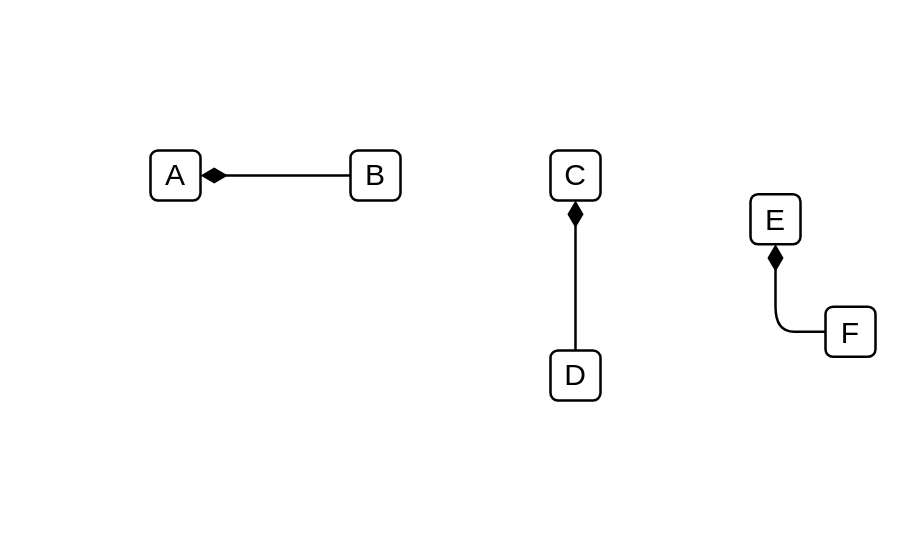
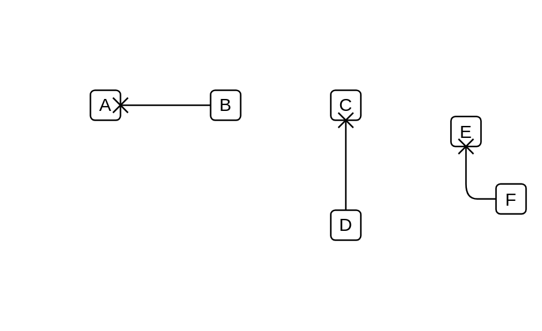
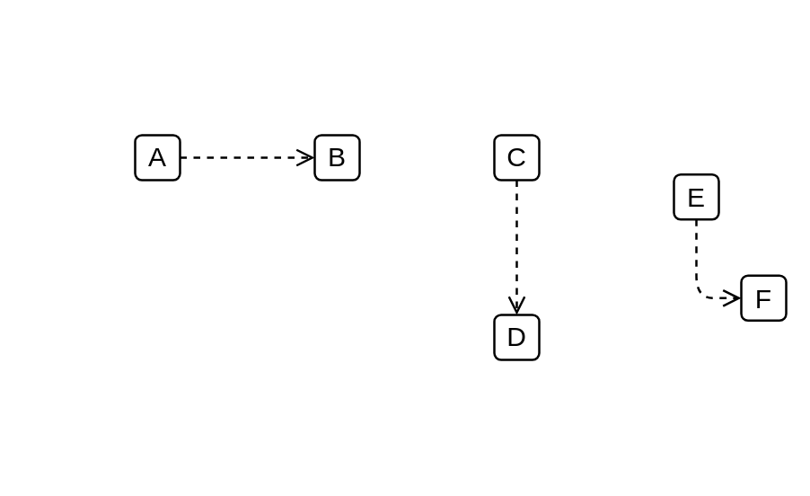
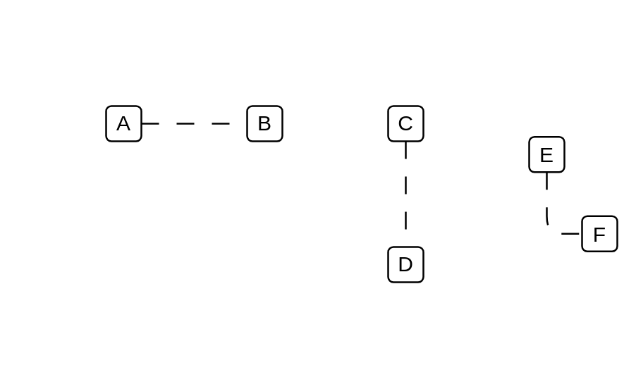
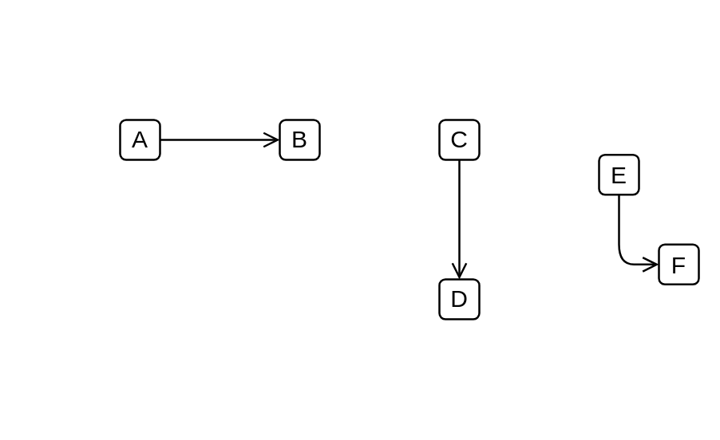
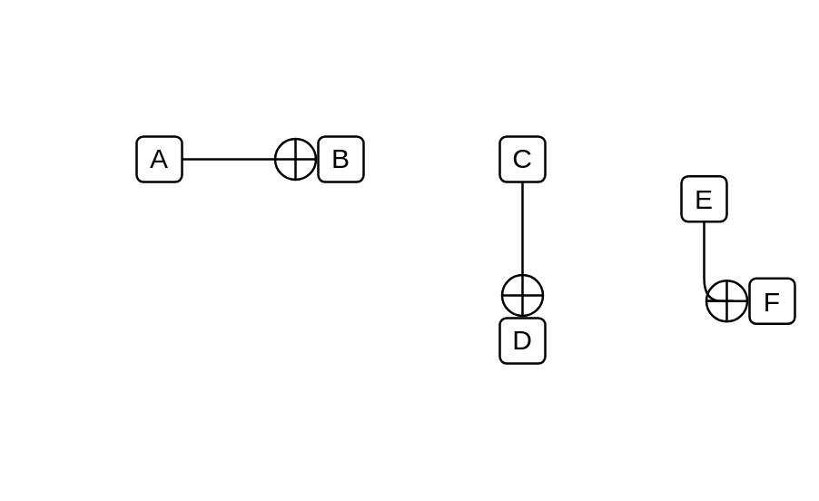

# Uml UML 2.5 Dependencies

- [Activity](./activity.md)  

- [AssociationConnectorInstanceSpecificationPropertyConnectorEnd](./association-connector-instance-specification-property-connector-end.md)  

- [AssociationConnectorInstanceSpecificationPropertyConnectorEndCompositeAssociation](./association-connector-instance-specification-property-connector-end-composite-association.md)  

- [AssociationConnectorInstanceSpecificationPropertyConnectorEndNavigabilityNotation](./association-connector-instance-specification-property-connector-end-navigability-notation.md)  

- [AssociationConnectorInstanceSpecificationPropertyConnectorEndNonNavigabilityNotation](./association-connector-instance-specification-property-connector-end-non-navigability-notation.md)  

- [AssociationConnectorInstanceSpecificationPropertyConnectorEndSharedAssociation](./association-connector-instance-specification-property-connector-end-shared-association.md)  

- [CollaborationUse](./collaboration-use.md)  

- [Constraint](./constraint.md)  

- [ControlFlow](./control-flow.md)  

- [ElementPackageMergePackageImportSubstitution](./element-package-merge-package-import-substitution.md)  

- [InnerClass](./inner-class.md)  

- [Message](./message.md)  

- [MessageReply](./message-reply.md)  

- [MessageSynchronousCall](./message-synchronous-call.md)  

- [ProvidedInterface](./provided-interface.md)  

- [Realization](./realization.md)  

- [RequiredInterface](./required-interface.md)  

