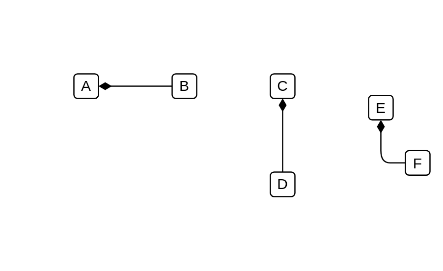

# Association / Connector / Instance Specification / Property / Connector End / Composite Association

## Definition

```js
{
  _style: {
    dependency: 'endArrow=none;startArrow=diamondThin;endFill=0;startFill=1;html=1;verticalAlign=bottom;labelBackgroundColor=none;strokeWidth=1;startSize=8;endSize=8;',
  },
}
```

## Usage

```js
import { AssociationConnectorInstanceSpecificationPropertyConnectorEndCompositeAssociation } from '@dinghy/standard-components-diagrams/uml25'

<AssociationConnectorInstanceSpecificationPropertyConnectorEndCompositeAssociation/>
```

## Preview


