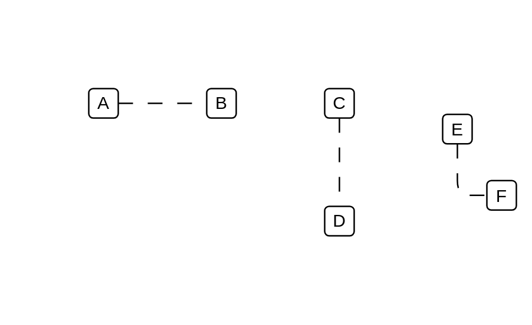

# Constraint

## Definition

```js
{
  _style: {
    dependency: 'endArrow=none;startArrow=none;endFill=0;startFill=0;endSize=8;html=1;verticalAlign=bottom;dashed=1;labelBackgroundColor=none;dashPattern=10 10;',
  },
}
```

## Usage

```js
import { Constraint } from '@dinghy/standard-components-diagrams/uml25'

<Constraint/>
```

## Preview


