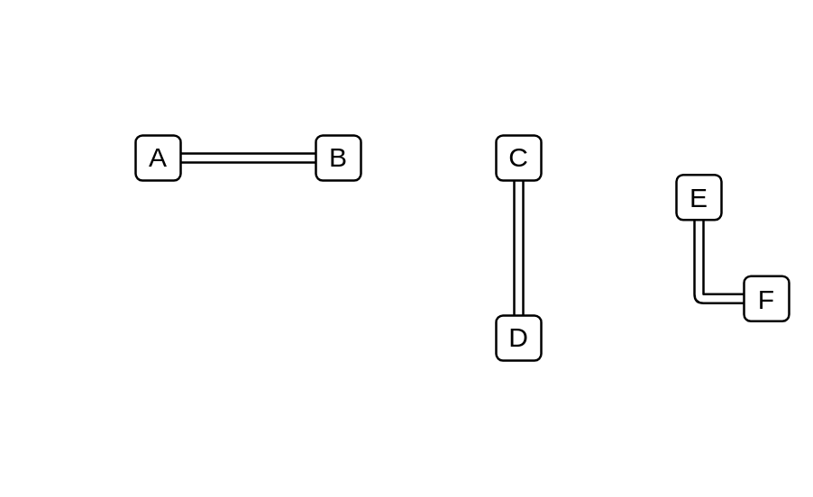

# Link

## Definition

```js
{
  _style: {
    dependency: 'shape=link;html=1;',
  },
}
```

## Usage

```js
import { Link } from '@dinghy/standard-components-diagrams/general'

<Link/>
```

## Preview


