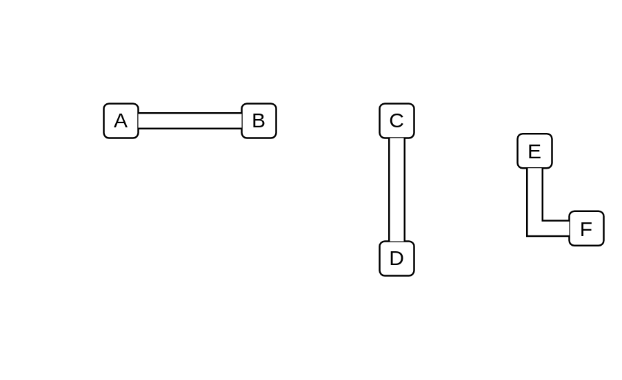
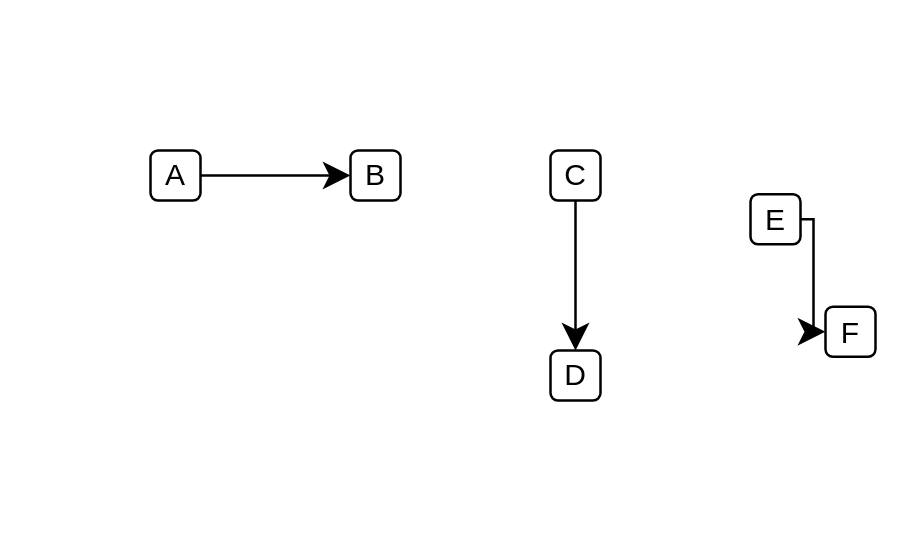
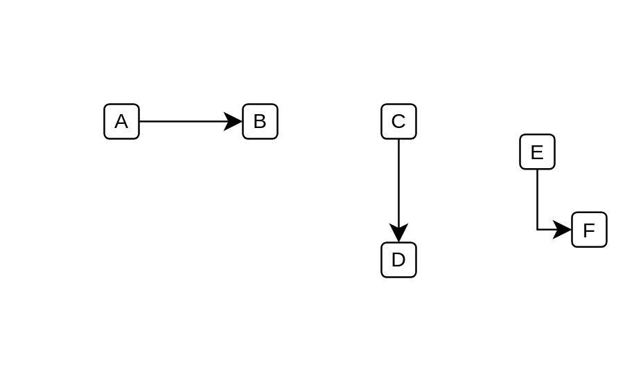
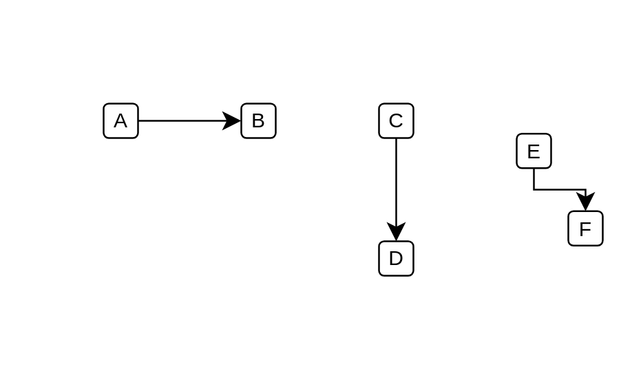

# Standard Misc Dependencies

- [FilledEdge](./filled-edge.md)  

- [HorizontalElbow](./horizontal-elbow.md)  

- [IsometricEdge1](./isometric-edge-1.md)  

- [IsometricEdge2](./isometric-edge-2.md)  

- [ManualLine](./manual-line.md)  

- [VerticalElbow](./vertical-elbow.md)  

