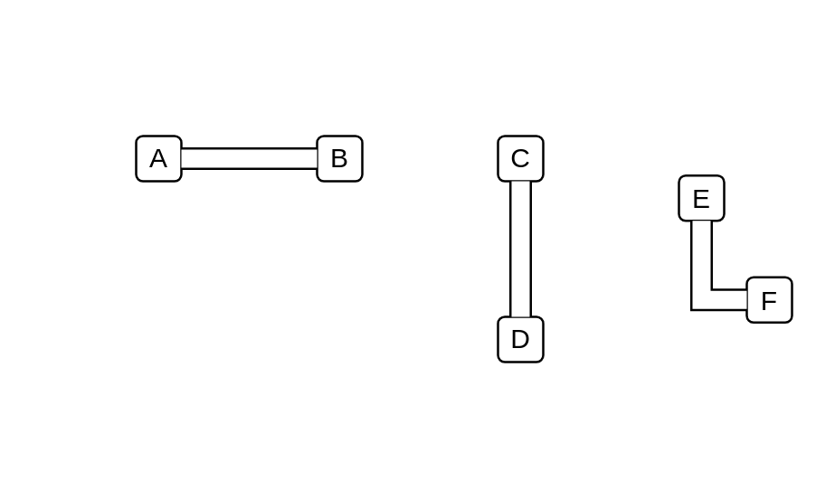

# Filled Edge

## Definition

```js
{
  _style: {
    dependency: 'shape=filledEdge;curved=0;rounded=0;fixDash=1;endArrow=none;strokeWidth=10;fillColor=#ffffff;edgeStyle=orthogonalEdgeStyle;html=1;',
  },
}
```

## Usage

```js
import { FilledEdge } from '@dinghy/standard-components-diagrams/misc'

<FilledEdge/>
```

## Preview


