# Business ArchiMate 2.1 Entities

- [ApplicationCollaboration](./application-collaboration.md)  

- [ApplicationComponent](./application-component.md)  

- [ApplicationFunction](./application-function.md)  

- [ApplicationInteraction](./application-interaction.md)  
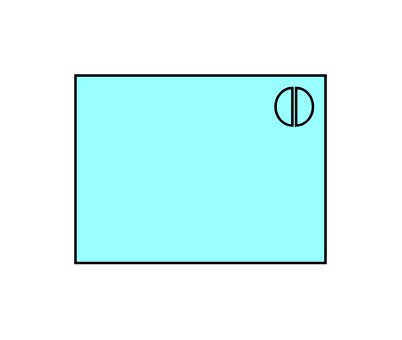

- [ApplicationInterface](./application-interface.md)  
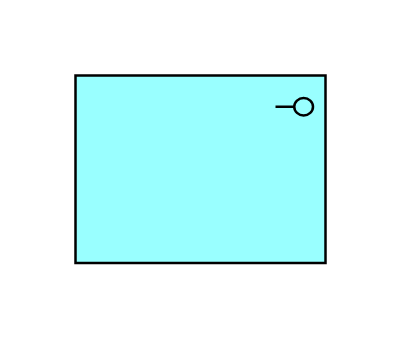

- [ApplicationInterface2](./application-interface-2.md)  

- [ApplicationService](./application-service.md)  

- [Artifact](./artifact.md)  
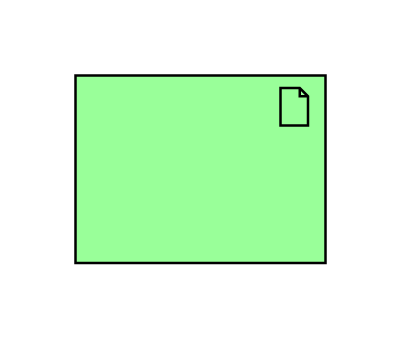

- [Assessment](./assessment.md)  

- [BusinessActor](./business-actor.md)  

- [BusinessCollaboration](./business-collaboration.md)  

- [BusinessEvent](./business-event.md)  

- [BusinessFunction](./business-function.md)  

- [BusinessInteraction](./business-interaction.md)  
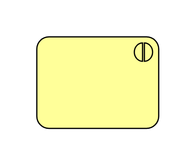

- [BusinessInterface](./business-interface.md)  
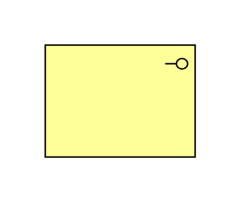

- [BusinessInterface2](./business-interface-2.md)  

- [BusinessObject](./business-object.md)  

- [BusinessProcess](./business-process.md)  
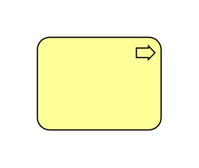

- [BusinessRole](./business-role.md)  

- [BusinessService](./business-service.md)  

- [CommunicationsPath](./communications-path.md)  
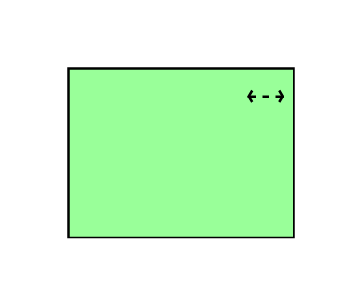

- [Constraint](./constraint.md)  
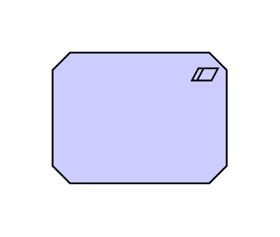

- [DataObject](./data-object.md)  

- [Deliverable](./deliverable.md)  
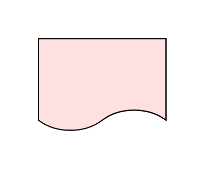

- [Device](./device.md)  
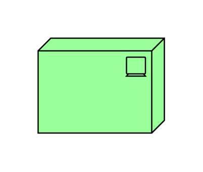

- [Driver](./driver.md)  

- [Gap](./gap.md)  

- [Goal](./goal.md)  

- [Grouping](./grouping.md)  

- [InfrastructureFunction](./infrastructure-function.md)  

- [InfrastructureInterface](./infrastructure-interface.md)  
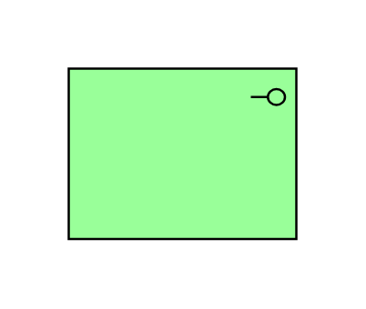

- [InfrastructureInterface2](./infrastructure-interface-2.md)  

- [InfrastructureService](./infrastructure-service.md)  
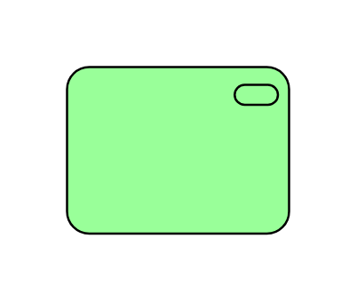

- [Junction](./junction.md)  

- [Location](./location.md)  

- [Meaning](./meaning.md)  

- [Network](./network.md)  
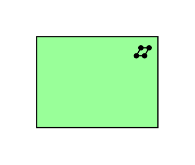

- [Node](./node.md)  

- [Plateau](./plateau.md)  
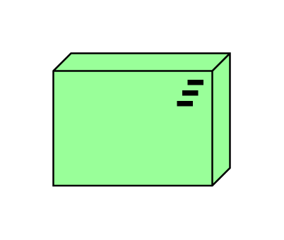

- [Principle](./principle.md)  

- [Product](./product.md)  
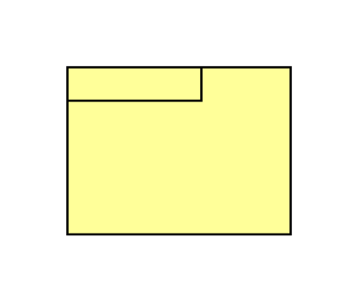

- [Representation](./representation.md)  

- [Requirement](./requirement.md)  

- [Stakeholder](./stakeholder.md)  
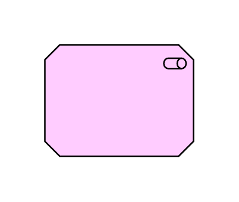

- [SystemSoftware](./system-software.md)  

- [Value](./value.md)  
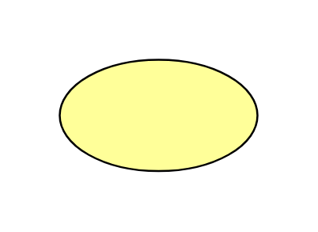

- [WorkPackage](./work-package.md)  
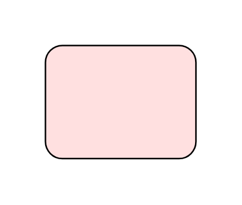
