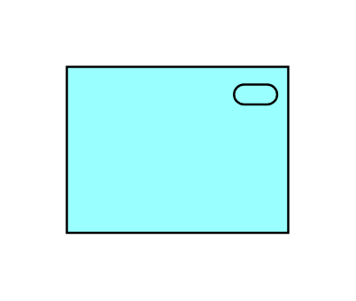

# Application Service

## Definition

```js
{
  _style: {
    entity: 'html=1;outlineConnect=0;whiteSpace=wrap;fillColor=#99ffff;shape=mxgraph.archimate.application;appType=service',
  },
  _width: 100,
  _height: 75,
}
```

## Usage

```js
import { ApplicationService } from '@dinghy/standard-components-diagrams/archimate2'

<ApplicationService/>
```

## Preview


