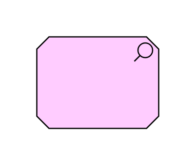

# Assessment

## Definition

```js
{
  _style: {
    entity: 'html=1;outlineConnect=0;whiteSpace=wrap;fillColor=#ffccff;shape=mxgraph.archimate.motiv;motivType=assess',
  },
  _width: 100,
  _height: 75,
}
```

## Usage

```js
import { Assessment } from '@dinghy/standard-components-diagrams/archimate2'

<Assessment/>
```

## Preview


